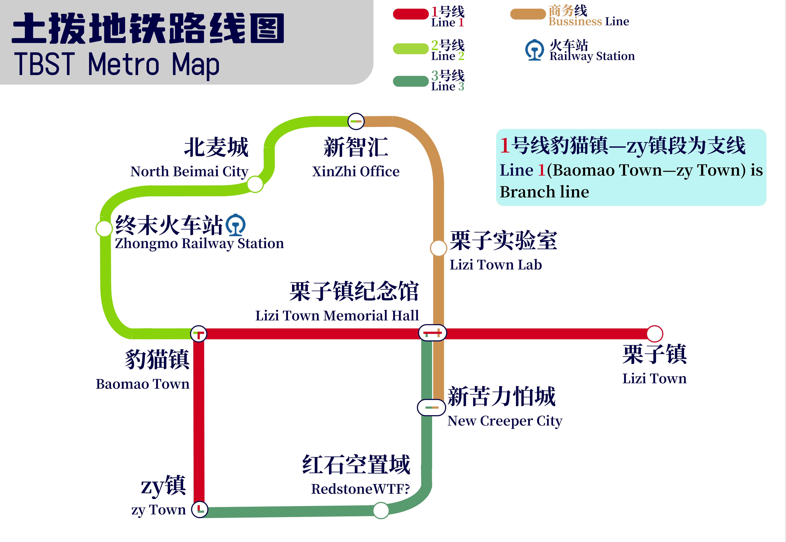

# 世界规划

## 世界规划

本服务器为类似乡村聚落式发展。

目前所有镇：(已经符合要求)

<table><thead><tr><th align="center">名称</th><th>镇长</th><th data-hidden align="center">位置（中心点）</th></tr></thead><tbody><tr><td align="center">栗子镇</td><td>草方块[GrassBlock2022]</td><td align="center">-</td></tr><tr><td align="center">豹猫镇</td><td>emo了[zihan123]</td><td align="center">-</td></tr><tr><td align="center">zy镇</td><td>zyqsbn[zyqsbn]</td><td align="center"></td></tr><tr><td align="center">HM镇（已经和豹猫镇合并）</td><td>暂无</td><td align="center"></td></tr></tbody></table>

## **建设规划：**

### **铁路规划**

### 

版本：114514.0

制作：pok OS寶可操作系統

***

_以上信息可能已经过时，请及时关注群内(733345889)消息！_
