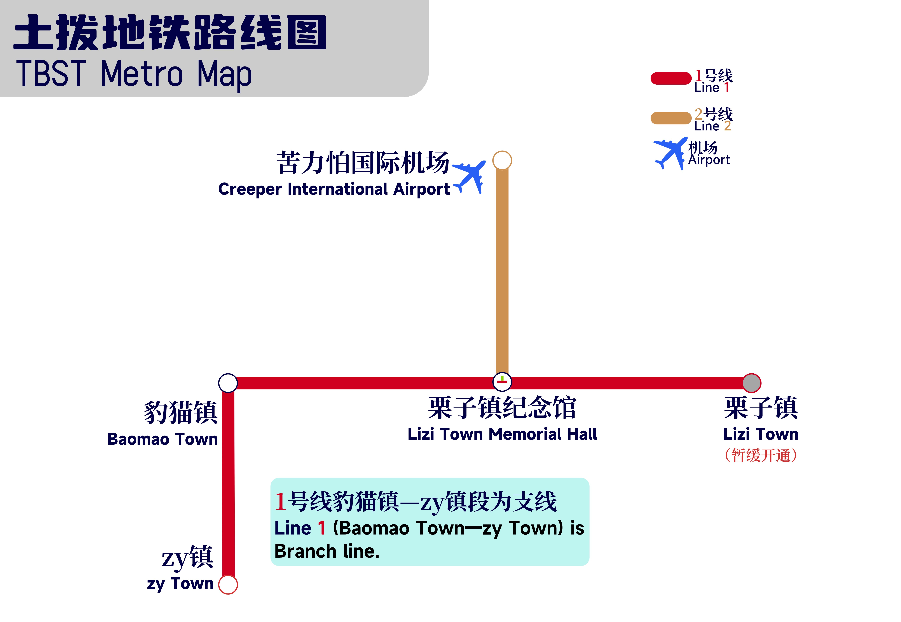

# 世界规划

## 世界规划

本服务器为类似乡村聚落式发展。

目前所有镇：(已经通过审核)

<table><thead><tr><th align="center">名称</th><th>镇长</th><th data-hidden align="center">位置（中心点）</th></tr></thead><tbody><tr><td align="center">栗子镇</td><td>草方块[GrassBlock2022]</td><td align="center">-</td></tr><tr><td align="center">豹猫镇</td><td>emo了[zihan123]</td><td align="center">-</td></tr><tr><td align="center">ZY镇</td><td>zyqsbn[zyqsbn]</td><td align="center"></td></tr></tbody></table>

## **建设规划：**

### **铁路规划**

### 

补充：商务线已经更名为2号线，新苦力怕城站 和 栗子镇实验室已经被取消，栗子镇 暂缓开通。三号线规划已经废除。

制作：兰熙不是兰溪 ⁧\~嗷呜⁧⁧

### 公路规划

.png>)

第一版

补充：部分路段暂未标注，等待补全。


服务器规划可能会实时变更，具体信息请参考群内消息。

