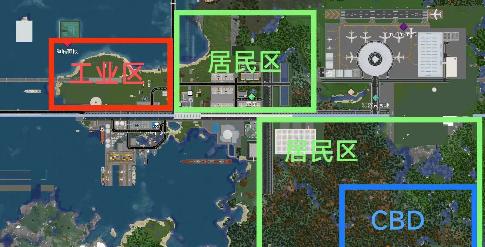

# 服务器发展规划

## 行政区域规划

~~**本服务器目前为类似乡村聚落式的发展方式**~~

目前所有镇：(已经通过审核)

<table><thead><tr><th align="center">名称</th><th>镇长</th><th>副镇长</th><th data-hidden align="center">位置（中心点）</th></tr></thead><tbody><tr><td align="center">栗子镇</td><td>小小苦力怕[Little_creeper]</td><td>zihan233[zihan123]</td><td align="center">-</td></tr><tr><td align="center">豹猫镇</td><td>土拨鼠[tuboshu]</td><td>一只Merry[ShawnMerry]</td><td align="center">-</td></tr><tr><td align="center">ZY镇</td><td>zyqsbn[zyqsbn]</td><td>暂无本职务</td><td align="center"></td></tr></tbody></table>

_ps：因为服务器建造市场已经饱和，没有新兴的建筑群，故从2023.7.10日开始不再新建镇_

## **建设规划：**

### **镇规划**

#### 栗子镇规划

制作者：小小苦力怕

#### 豹猫镇规划

豹猫镇正在对答辩建筑进行整治和道路拓宽，请适当的将您的建筑与道路保持距离！

### **轨道交通**

### .png>)

补充：_**商务线已经更名为2号线**_，栗子镇站封站改造已经完成。~~_栗子镇国际机场目前正在试运行通车_。~~

制作：土拨鼠⁧⁧


服务器规划可能会与实际执行稍有差异，具体信息请参考群内公告消息。

