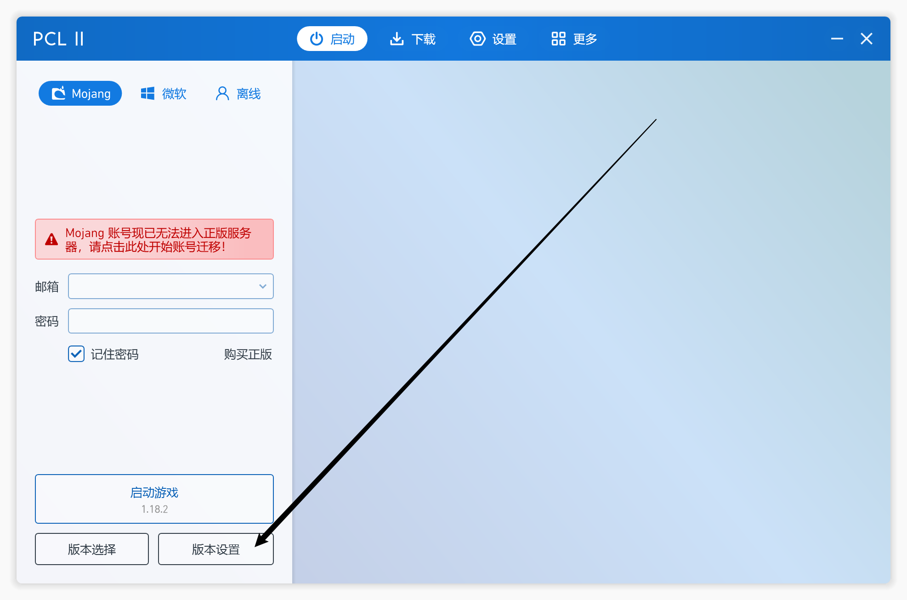
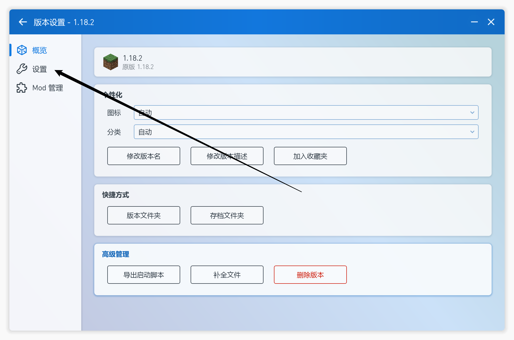
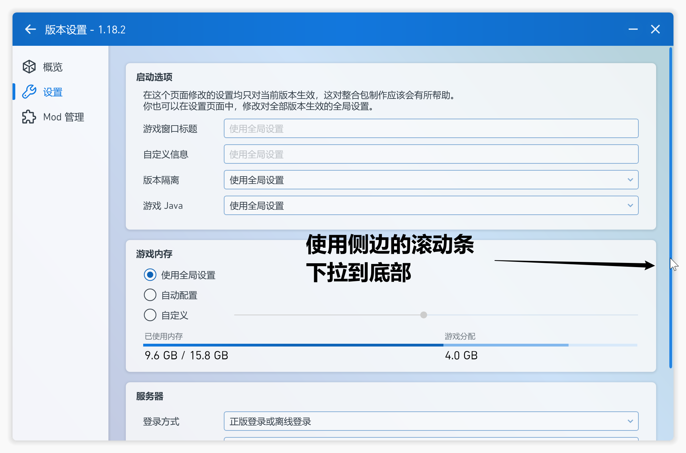
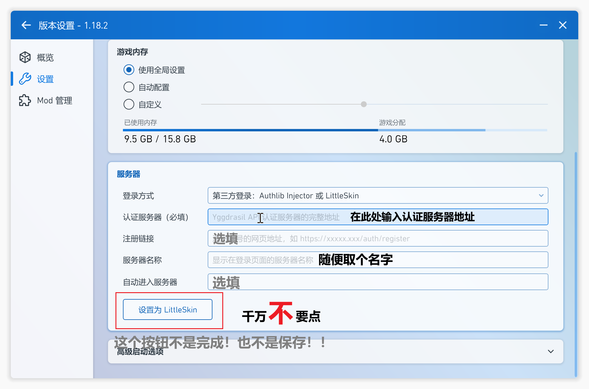
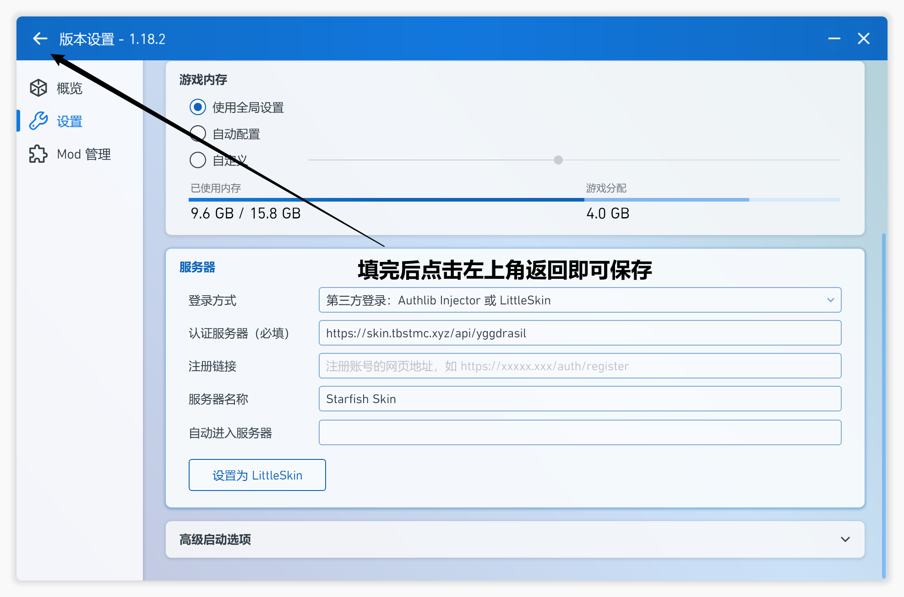

# ⭐ 配置外置登录

**1.引子**

**要想进入TBSTCraft并且没有正版账户的看过来，服务器现在支持注册皮肤站上服了。**

**外置登陆**是离线Minecraft服务器的一种账户的认证方式，原理是利用原版Minecraft的api进行修改认证服务器，做到走自己的第三方服务器来进行认证和来还原原版Minecraft登陆的体验！下面我们来介绍**PCL2**和**HMCL**启动器的外置登陆使用方法！

> **若您要上服，，请做好以下准备**
>
> 1. **在使用前请先前往**[**Starfish Skin**](https://skin.tbstmc.xyz)**进行登录或者注册以保证后续步骤可以正常使用**！
> 2. 下载（或准备）好一个你可以**正常使用**的MC游戏版本
> 3. 一个能**正常**连上皮肤站的设备

**2.PCL2使用外置登陆** ——by Cube

* 1.先打开PCL启动器，选择你要配置的游戏版本，并点击设置
* 
* 2.选择游戏的详细设置
* 
* 3.拉到界面底部
* 
* 4.在登陆服务器这里选择_第三方登录：Authlib Injector或 LittleSkin_这一个选项_**（记住这里不是让你注册Littleskin啊啊啊啊啊啊啊啊啊啊啊啊啊）**_
* 
* 4.设置为Starfish Skin皮肤站的认证地址（在皮肤站的个人中心会显示）：[`https://skin.tbstmc.xyz/api/yggdrasil`](https://skin.tbstmc.xyz/api/yggdrasil)
* 
* 注意：**千万**<mark style="color:red;">**不要**</mark>**点底下的** _设置为 LittleSkin_ **按钮，直接返回即可保存**
* 
* 5.返回主页，在弹出的登陆位置输入你的皮肤站账号（邮箱）和密码
* 6.输入完信息后，点击启动游戏，如果**账户密码正确**，则启动器会自动帮你登陆完成并且启动游戏。
* 进入游戏后，就可以前往服务器进行游玩了

**3.HMCL使用外置登陆** ——by 土拨鼠

* 1.先打开HMCL启动器，点击**添加账户**

<figure><figcaption>
第一步
</figcaption></figure>

* 2.点击界面左下角的**添加认证服务器**选项

<figure><figcaption>
第二步
</figcaption></figure>

* 3.设置为Starfish Skin皮肤站的服务器的认证地址。

> 验证服务器地址：[`https://skin.tbstmc.xyz/api/yggdrasil`](https://skin.tbstmc.xyz/api/yggdrasil)
>
> _在Starfish Skin个人主页的下方即可查看_

<figure><figcaption>
第三步 输入完前面地址后点击下一步
</figcaption></figure>

* 4.添加完毕后返回账户列表

<figure><figcaption>
第四步 看到这个界面说明添加成功了，点击完成
</figcaption></figure>

* 5.点击左侧出现的外置登录服务器名称，在弹出的窗口输入你的皮肤站账号和密码

<figure><figcaption>
第五步 找到左侧新出现的外置登录服务器名称，点击他并填写你的账户密码
</figcaption></figure>

* 6..输入完信息后，点击启动游戏，启动器会自动帮你登陆完成。
* 至此，外置登陆配置就好了！

**4.温馨提示**

**如果你连怎么安装MC都不会，请正确使用搜索引擎来解决问题。**

**外置登陆**不能与**正版登陆**并存，如果想关闭外置登陆，请在上述过程中，PCL2可以在选择登陆方式那里，换回“离线登录和正版登陆”的选项来恢复你的离线登录或者正版登陆等，HMCL可以在账户列表里面直接切换你的离线登录或者正版登录等。

_如果有能力，建议还是支持下正版吧，毕竟现在Java和基岩捆绑销售才89RMB（可以前往_[_Minecraft官网_](https://www.minecraft.net/zh-hans/store/minecraft-java-bedrock-edition-pc)_查看购买价格！）_
