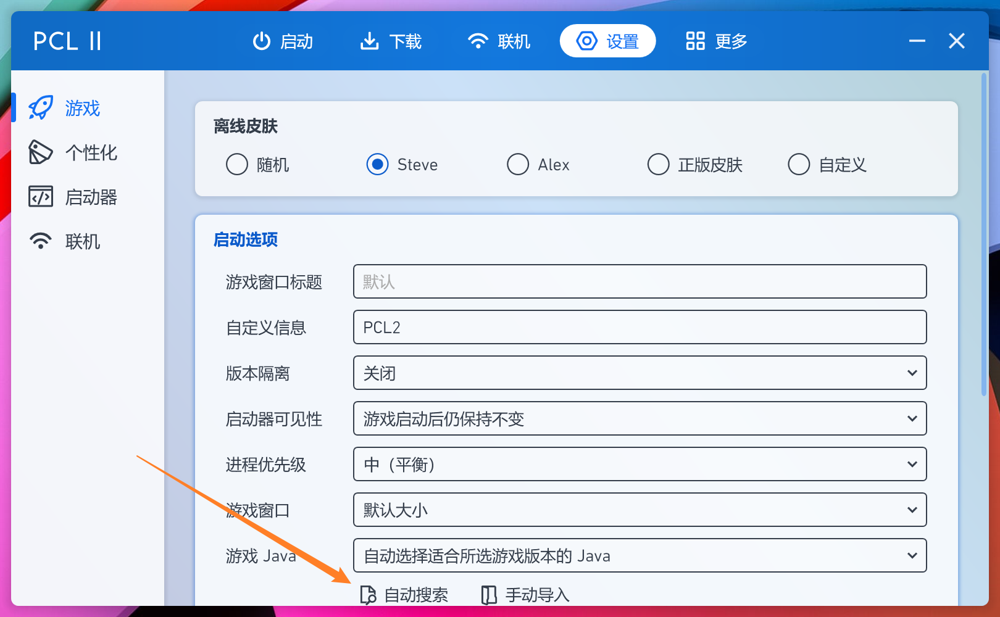
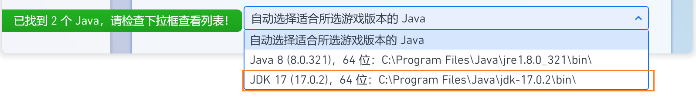
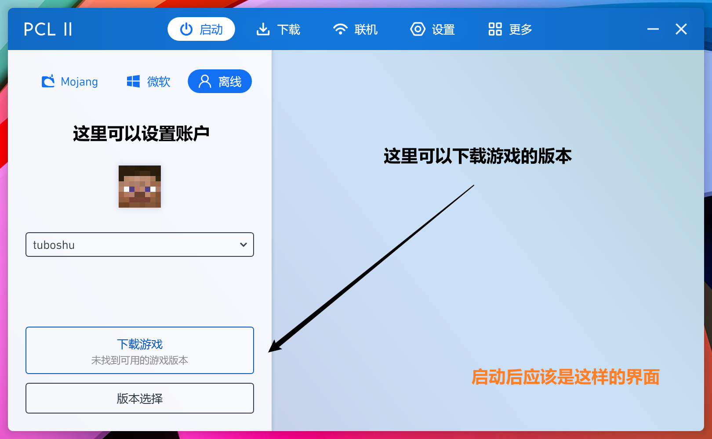

# 服务器教程 - 电脑版软件安装教程

# 准备

## 下载启动器

> HMCL官网：<https://hmcl.huangyuhui.net>(可以直接下载！)
>
> PCL2官网：<https://afdian.net/@LTCat> (需要去手动查看动态和下载链接,详细见后文)

## 安装环境和启动器

### HMCL

#### 放置启动器

下载完毕后创建一个**新的空文件夹**（最好是在*桌面*），只需要把**下载的HMCL启动器的exe文件**移动到刚刚创建的**空文件夹**内，如图上所示。*（文件夹的名字和HMCL的exe的名称可能不同，请忽略）*

#### 安装

##### 安装Java环

**请关注下文的JDK17安装教程！**

##### 打开/运行启动器

我们双击HMCL启动器的exe就可以开始体验了。

*启动后会在当然目录下自动创建一个.minecraft文件夹，如上图所示，你不需要去动他，使用软件即可！*

******

### PCL2

*注意，这里用的是PCL2启动器，不是PCL！*

#### 下载和放置启动器

> PCL2官方永久更新地址：
>
> <code>下载1(推荐)：https://wwx.lanzoum.com/ixJnZ01hkvfa</code>
>
> <code>下载 2：https://pan.baidu.com/s/1Sqbp21g4zVDjJExMnljeHg?pwd=2f89 </code>

下载完毕后在你喜欢的地方新建文件夹并且把下载的<code>Plain Craft Launcher 2.exe</code>放入里面 *(下载的文件名称可能不同，请忽略)*

#### 安装Java环境（⭐新）

*因为TBST服务器为了保证流畅以及尽量多新功能，所以从4月份启正式升级了服务器版本为1.18.1，但是1.18对于很多低配电脑很不友好，我们在调试兼容插件后**确保各位可以从1.17.1或者1.17.2进入服务器**时可以最大兼容游玩。*

**因为1.17及其以上要求环境为Java的JDK17版本及其以上，所以请体验服务器的玩家参照本教程安装Java环境！**

>资源地址：
>
>Java JDK17官网地址：[Java Archive Downloads - Java SE 17 (oracle.com)](https://www.oracle.com/java/technologies/javase/jdk17-archive-downloads.html)
>
>*由于JDK17已经不怎么更新，所以我们准备了一份网盘地址*
>
>阿里云盘<code>https://www.aliyundrive.com/s/L7QtfuRphyf</code>
>
>[自营]简小盘<code>https://pan.tuboshu233.xyz/s/RAf8</code>

下载完毕打开安装程序一直下一步完成安装即可

#### 运行启动器/基本配置

打开启动器后，先选择*设置*选项，点击自动搜索来搜索你已经Java版本

如果选项里面出现了JDK 17的选项那么说明你安装环境是正确并且有效的！

接下来就可以正确使用我们的启动器了。

# 使用

## 启动软件

这时候打开后会看到如下界面，那么说明你安装成功了！🎉

*默认是没有安装任何游戏版本，出现空的状态正常*，下一个教程我们会教你如何安装游戏。

