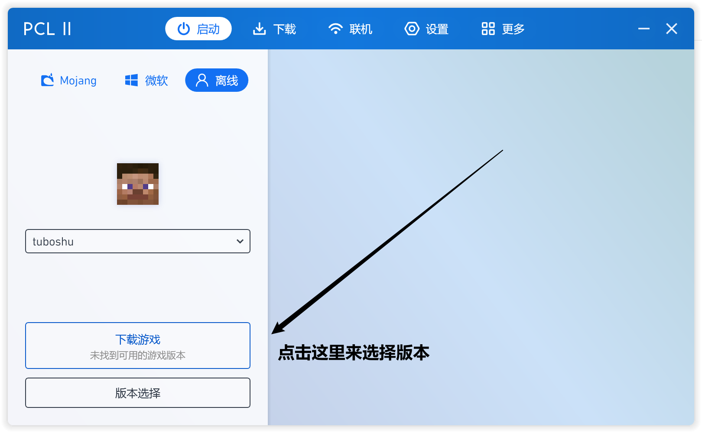
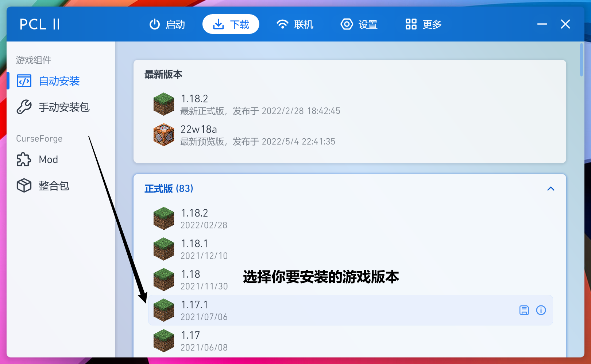
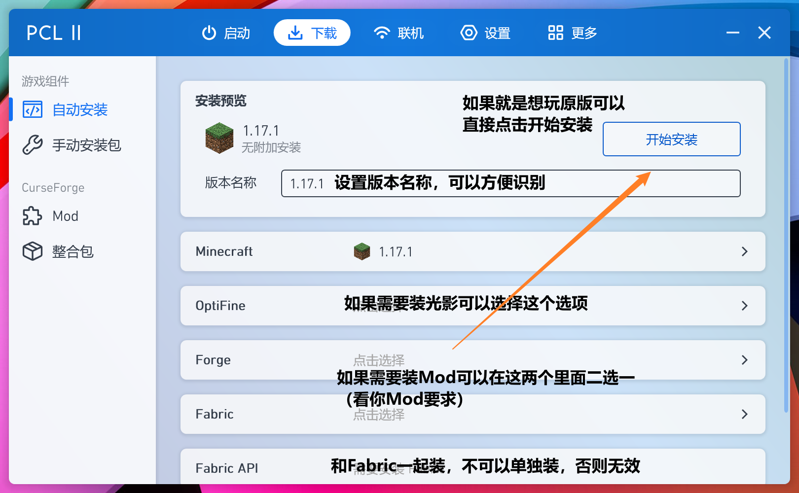
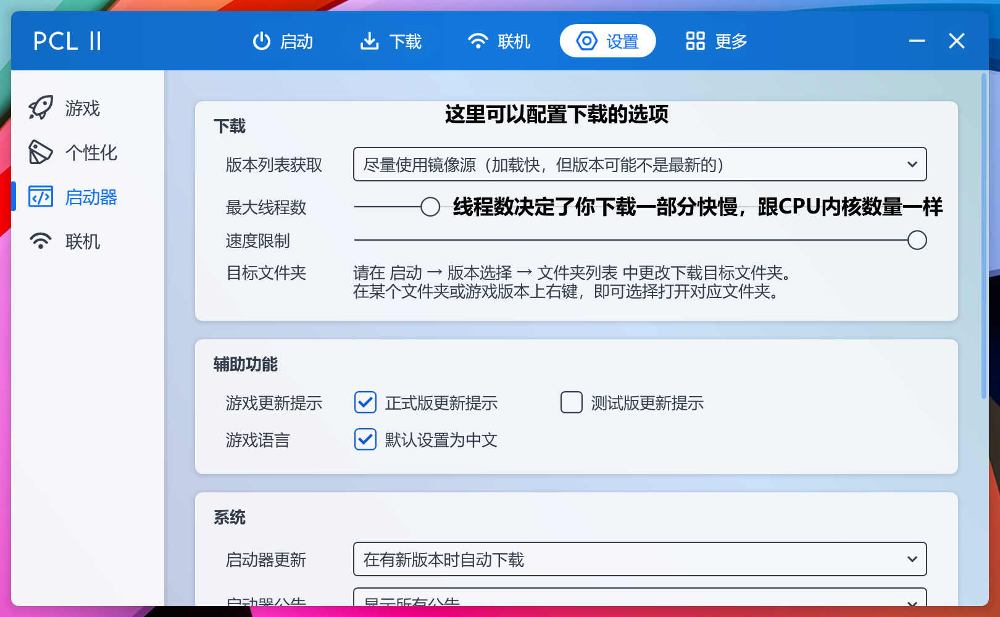

# ⭐[新版教程]PCL2启动器配置

## 创建登陆账户

<s>因为腐竹懒不想写了</s>这里的详细信息请到[如何使用外置登录](https://doc.tbstmc.xyz/#/教程/配置/TBST专属-电脑版外置登录教程)，本板块不在细述！

## 安装游戏

首先现在启动器左下角找到**下载游戏**选项

如图所示在**正式版**这个选项卡内可以找到你基本所需要的所有游戏版本

> 之前的教程里提到版本选择的问题，这里再次展示一遍
>
> “*因为TBST服务器为了保证流畅以及尽量多新功能，所以从4月份启正式升级了服务器版本为1.18.1，但是1.18对于很多低配电脑很不友好，我们在调试兼容插件后**确保各位可以从1.17.1或者1.17.2进入服务器**时可以最大兼容游玩。*”

所以本教程选择了*1.17.1*这个版本，如果你需要安装更高版本只需要选择高版本然后按照本教程来即可，后期操作并无差异。

选择之后会转到下载的详细界面，如图所示。

选择完毕后可以直接点击**开始安装选项**，等待版本下载完毕。

> 如何设置下载/如何提供下载速度？
>
> 
>
> 在设置里面可以配置下载的下载源和最大线程数
>
> **注意，线程数过大可能会引起电脑或者软件的卡顿，如果你想烤鸡可以试（逝）试（世）~**

下载完毕后就可以启动游戏愉快的游玩啦~