# ⭐ 配置外置登录

### 引子

**要想进入TBSTCraft并且没有正版账户的看过来，服务器现在支持注册皮肤站上服了！**

**外置登陆**是离线Minecraft服务器的一种账户的认证方式，原理是利用原版Minecraft的api进行修改认证服务器，做到走自己的第三方服务器来进行认证和来还原原版Minecraft登陆的体验！下面我们来介绍**PCL2、HMCL和BakaXL**启动器他们分别的外置登陆使用方法！

> **若您要上服，，请做好以下准备**
>
> 1. **在使用前请先前往** [**Starfish Skin**](https://skin.tbstmc.xyz) **进行登录或者注册以保证后续步骤可以正常使用**！
> 2. _下载_（或_准备_）好一个你可以**正常使用和游玩**的MC游戏版本（最好是你常用的）
> 3. 一个能**正常**连上皮肤站的设备（最好是你要登录服务器的电脑，这里不单单指访问域名）

### **PCL2使用外置登陆** ——by Cube

* 1.先打开PCL启动器，选择你要配置的游戏版本，并点击设置
* 
* 2.选择游戏的详细设置
* 
* 3.拉到界面底部
* 
* 4.在登陆服务器这里选择_第三方登录：Authlib Injector或 LittleSkin_这一个选项_**（记住这里不是让你注册Littleskin啊啊啊啊啊啊啊啊啊啊啊啊啊）**_
* 
* 4.设置为Starfish Skin皮肤站的认证地址（在皮肤站的个人中心会显示）：[`https://skin.tbstmc.xyz/api/yggdrasil`](https://skin.tbstmc.xyz/api/yggdrasil)
* 
* 注意：**千万**<mark style="color:red;">**不要**</mark>**点底下的** _设置为 LittleSkin_ **按钮，直接返回即可保存**
* 
* 5.返回主页，在弹出的登陆位置输入你的皮肤站账号（邮箱）和密码
* 6.输入完信息后，点击启动游戏，如果**账户密码正确**，则启动器会自动帮你登陆完成并且启动游戏。
* 进入游戏后，就可以前往服务器进行游玩了

### **HMCL使用外置登陆** ——by 土拨鼠

* 1.先打开HMCL启动器，点击**添加账户**
* 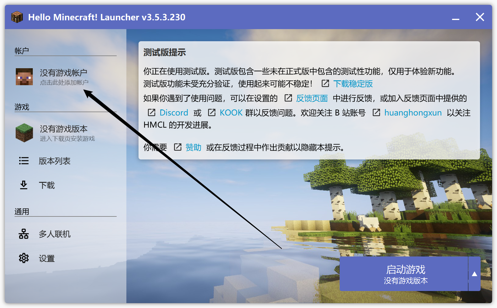
* 2.点击界面左下角的**添加认证服务器**选项
* 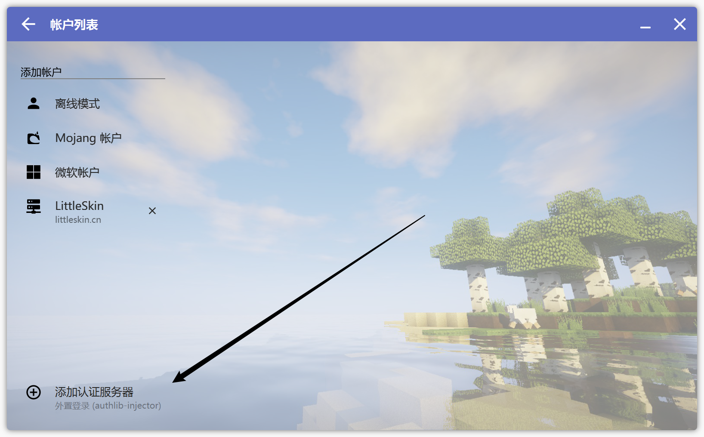
* 3.设置为Starfish Skin皮肤站的服务器的认证地址。
* 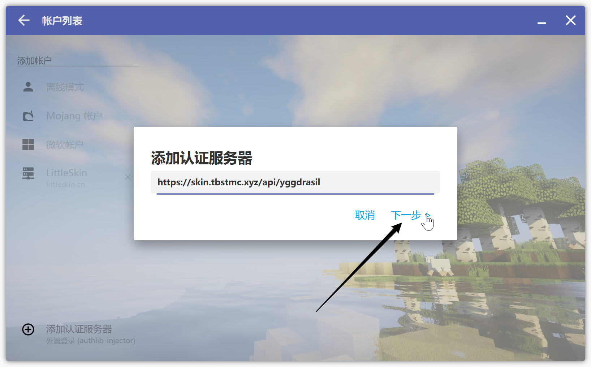

> 验证服务器地址：[`https://skin.tbstmc.xyz/api/yggdrasil`](https://skin.tbstmc.xyz/api/yggdrasil)
>
> _在Starfish Skin个人主页的下方即可查看_

* 4.添加完毕后返回账户列表
* 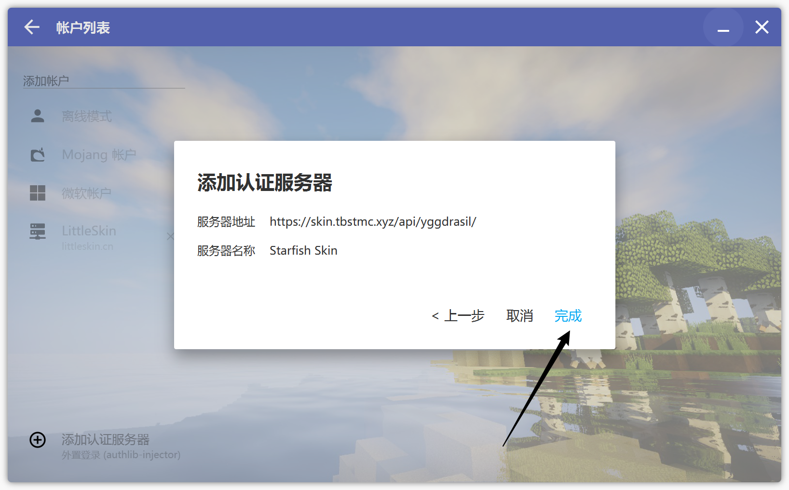
* 5.点击左侧出现的外置登录服务器名称，
* 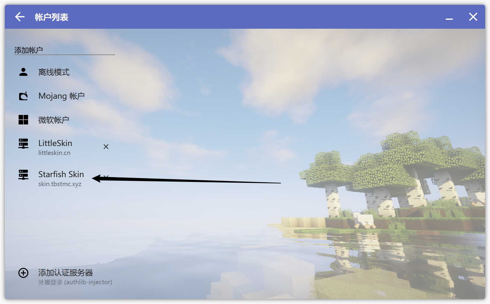
* 在弹出的窗口输入你的皮肤站账号和密码，输入完毕后点击 _完成_
* 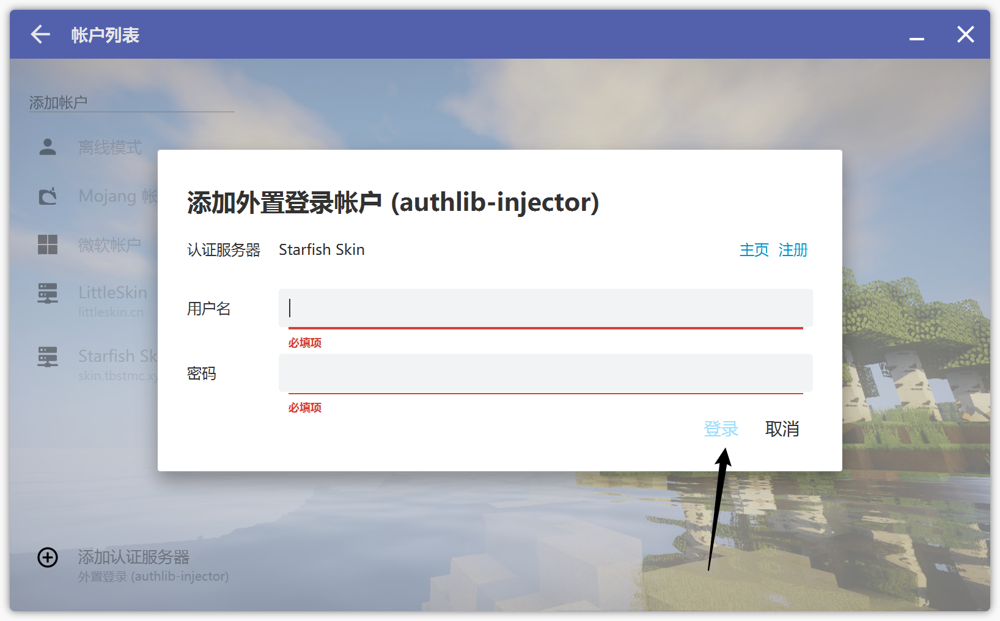
* 6.返回到主界面，点击启动游戏，启动器会自动帮你登陆完成。
* 至此，外置登陆配置就好了！

### BakaXL启动器配置教程 ——by 土拨鼠

* 打开BakaXL，进入主界面的 _本体设置_
* 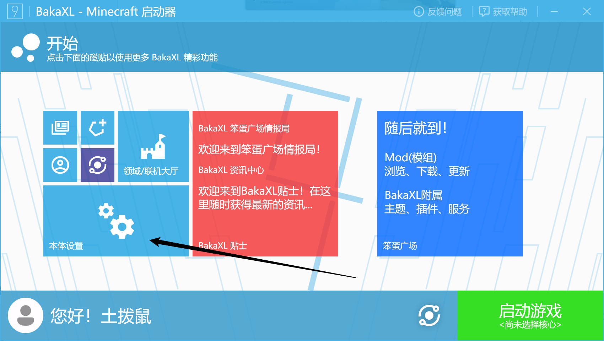
* 找到设置里侧边栏的 _账户与档案_
* 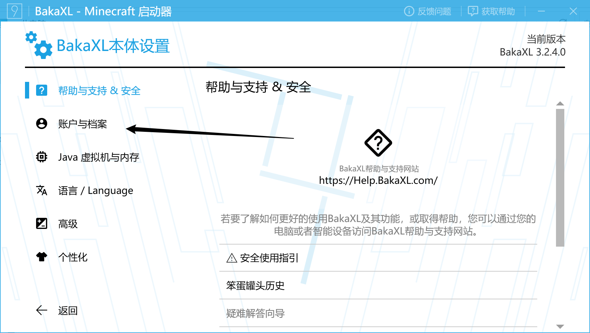
* 拉到底部，点击 _新增一个档案_
* 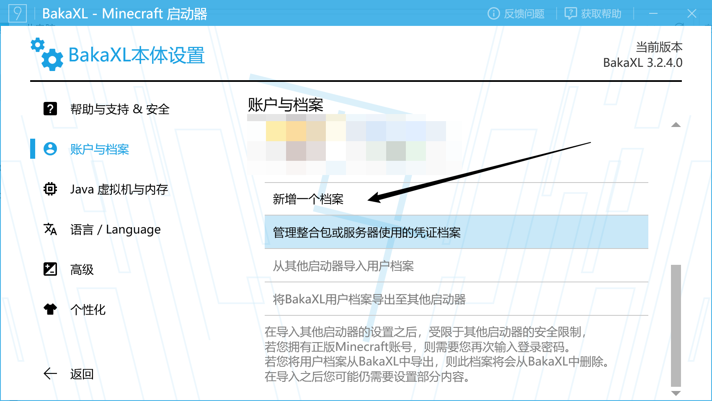
* 找到游戏启动模式 分别点击三次 _离线模式 位置的文字_ 来切换到外置登录
* 
* 在 _账户信息_ 里填写认证服务器地址
* 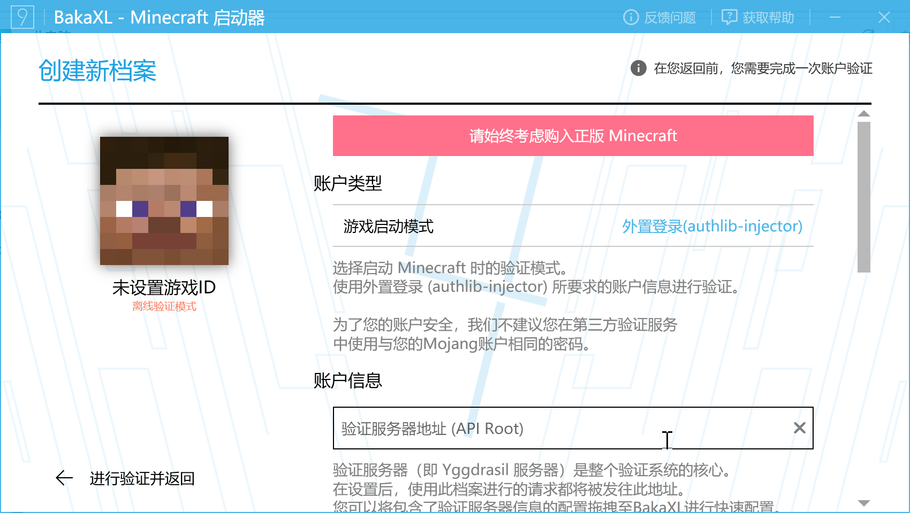

> 验证服务器地址：[`https://skin.tbstmc.xyz/api/yggdrasil`](https://skin.tbstmc.xyz/api/yggdrasil)
>
> _在Starfish Skin个人主页的下方即可查看_

* 输入完毕后，Bakaxl会校验验证服务器地址，
* 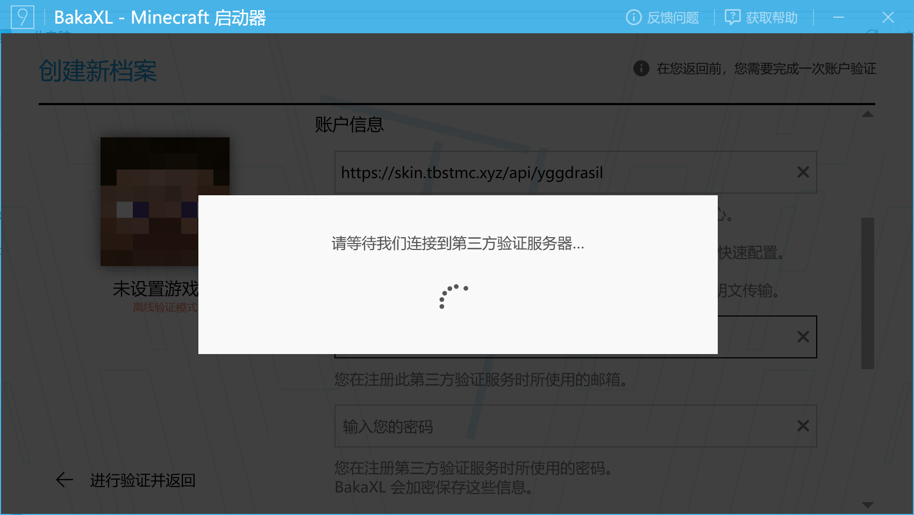
* 验证完毕后，即可输入账户密码，输入完毕后，点击左下角的 _验证并返回_
* 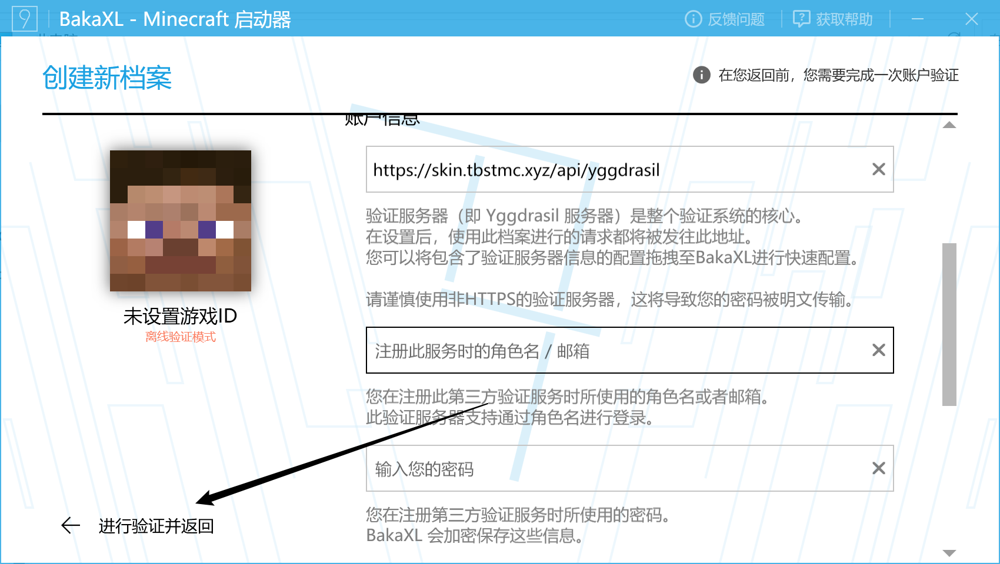
* 返回到主界面，点击启动游戏，启动器会自动帮你登陆完成。
* 至此，外置登陆配置就好了！

### **温馨提示**

**如果你连怎么安装MC都不会，请正确使用搜索引擎来解决问题。**

> **外置登陆**不能与**正版登陆**并存，如果想关闭外置登陆，请在上述过程中，PCL2可以在选择登陆方式那里，换回“离线登录和正版登陆”的选项来恢复你的离线登录或者正版登陆等，HMCL可以在账户列表里面直接切换你的离线登录或者正版登录，BakaXL可以在账户与档案中点击你需要的账户来进行切换等。
>
> _如果有能力，建议还是支持下正版吧，毕竟现在Java和基岩捆绑销售才 89 元。_~~_可以前往_~~[~~_Minecraft官网_~~](https://www.minecraft.net/zh-hans/store/minecraft-java-bedrock-edition-pc)_不知为什么Minecraft官网已经被锁区，请前往_[_XBOX_](https://www.xbox.com/zh-cn/games/store/minecraft-java-bedrock-edition-for-pc/9nxp44l49shj)_查看价格和购买_ ）
